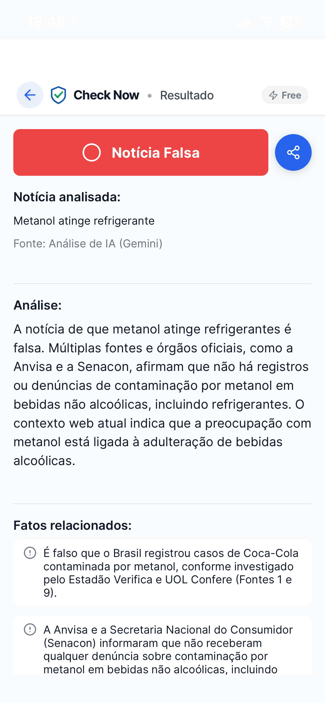
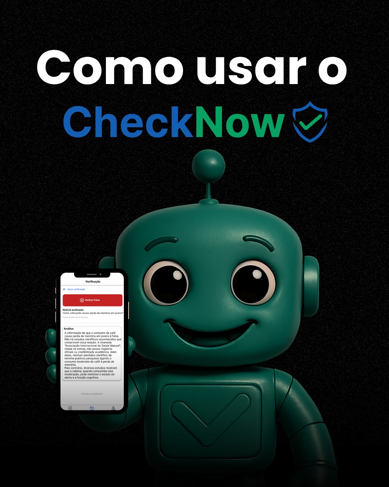
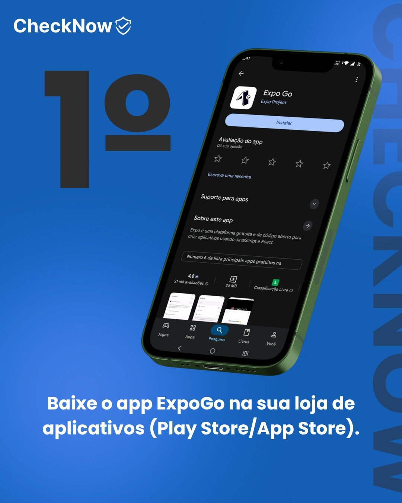
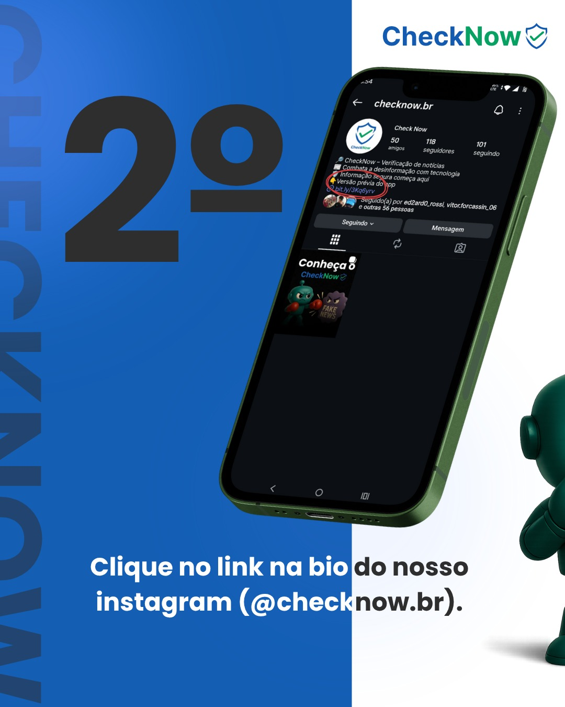
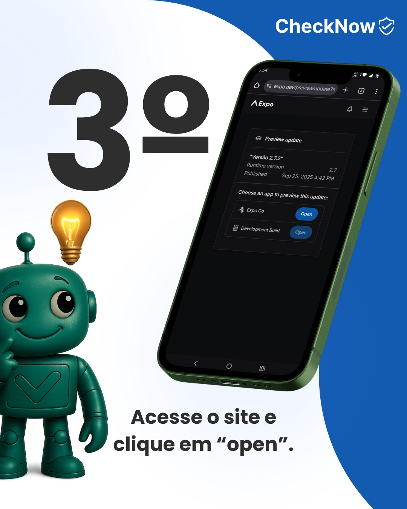
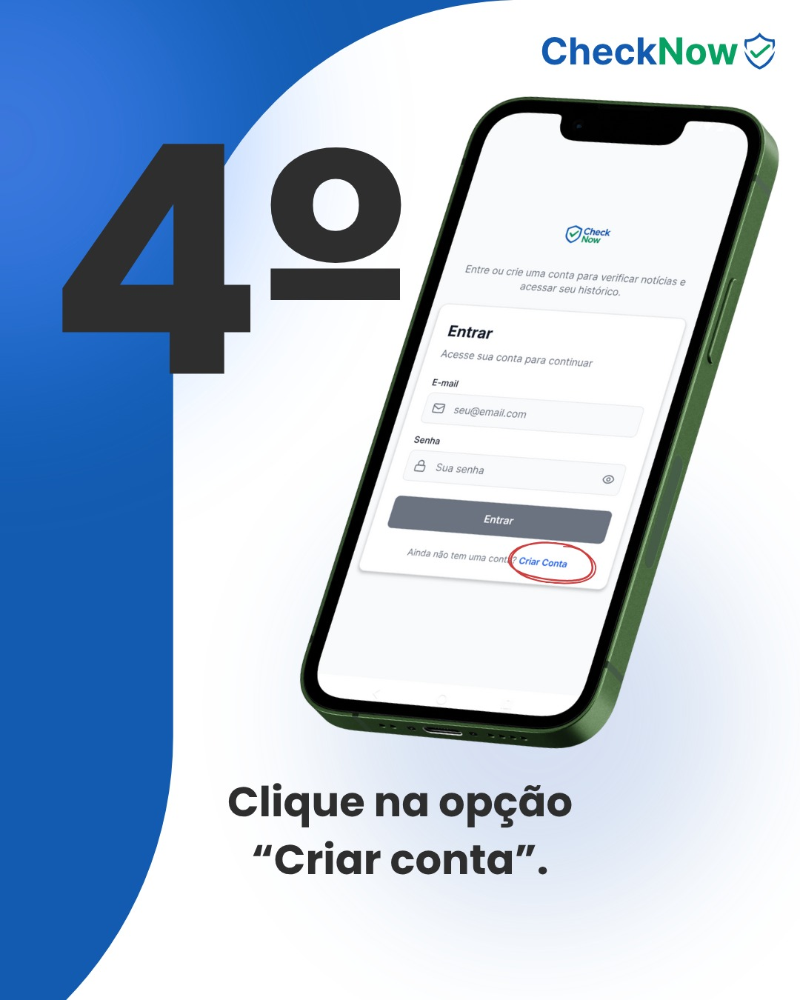
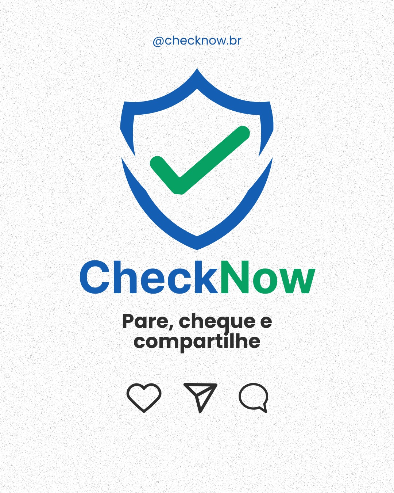

# 🔵 CheckNow — Verificador Inteligente de Notícias

**Trabalho de Conclusão de Curso (TCC) | Etec de Taboão da Serra — 2025**

> 🔵 **Sua defesa definitiva contra a desinformação!** Verificação inteligente de notícias com IA avançada e extração de conteúdo em tempo real.

---

## 🌟 Sobre o CheckNow

O **CheckNow** é uma aplicação móvel revolucionária desenvolvida como **Trabalho de Conclusão de Curso (TCC)** para o curso de **Desenvolvimento de Sistemas** na **Etec de Taboão da Serra — 2025**.

Vivemos em uma era de sobrecarga informacional, onde fake news se espalham mais rápido do que a verdade. O CheckNow nasceu para resolver esse problema: uma plataforma inteligente que utiliza **Inteligência Artificial de última geração** para verificar a veracidade de notícias e informações em segundos.

> 💡 **Missão:** Empoderar os cidadãos brasileiros com ferramentas acessíveis para combater a desinformação e promover uma sociedade mais informada e crítica.

---

## 🎯 Por que o CheckNow é Importante?

| Problema | Solução CheckNow |
|----------|-----------------|
| 🚨 Fake news se espalham em segundos | ✅ Verificação em tempo real com IA |
| 😵 Difícil identificar fontes confiáveis | ✅ Análise de múltiplas fontes simultaneamente |
| 📱 Falta de ferramentas acessíveis | ✅ App gratuito e intuitivo para todos |
| 🌐 Desinformação em português | ✅ Focado 100% no contexto brasileiro |
| ⏱️ Processo manual e demorado | ✅ Resultado em segundos com IA avançada |

A desinformação é uma ameaça real à democracia e à saúde pública. O CheckNow surge como uma solução tecnológica inovadora, democratizando o acesso à verificação de fatos e contribuindo para uma sociedade mais informada.

---

## 👥 Equipe

Este projeto foi desenvolvido com dedicação pelos alunos do curso de **Desenvolvimento de Sistemas** da **Etec de Taboão da Serra**:

<table align="center">
<tr>
<td align="center">
 
<b>Henrique Rezende</b> 
Desenvolvedor Full-Stack 
<a href="https://github.com/henriquercz">🐙 GitHub</a> •
<a href="mailto:henriquechagas06@gmail.com">📧 Email</a>
</td>

<td align="center">
 
<b>Guilherme Ferreira</b> 
Documentação 
<a href="https://github.com/guiguizy11">🐙 GitHub</a> •
<a href="mailto:henriquechagas06@gmail.com">📧 Email</a>
</td>

<td align="center">
 
<b>Artur Liu</b> 
Documentação / Desenvolvimento 
<a href="https://github.com/liuzinho777">🐙 GitHub</a> •
<a href="mailto:henriquechagas06@gmail.com">📧 Email</a>
</td>

<td align="center">
 
<b>Felipe Freitas</b> 
Documentação 
<a href="https://github.com/FelipeFreita91">🐙 GitHub</a> •
<a href="mailto:henriquechagas06@gmail.com">📧 Email</a>
</td>

<td align="center">
 
<b>Gabriel Moreira</b> 
Desenvolvimento 
<a href="https://github.com/gabriel-moreira10">🐙 GitHub</a> •
<a href="mailto:henriquechagas06@gmail.com">📧 Email</a>
</td>

</tr>
</table>

---

## ✨ Funcionalidades

### 🔍 Verificação Inteligente de Notícias
- **IA Avançada**: Powered by Google Gemini 2.5 Flash para análise precisa
- **Análise Multi-fonte**: Cruzamento de informações de diversas fontes confiáveis
- **Resultado Detalhado**: Status (Verdadeiro/Falso/Parcialmente Verdadeiro), resumo e fontes
- **Web Scraping**: Extração automática de conteúdo de páginas web para análise

### 📰 Feed de Notícias Integrado
- **Notícias em Tempo Real**: Feed atualizado com as principais notícias do Brasil
- **Verificação Direta**: Verifique notícias do feed com um toque
- **Bookmarks Inteligentes**: Salve notícias importantes para leitura posterior

### 🔐 Sistema de Usuários Robusto
- **Autenticação Supabase**: Login/cadastro seguro com email e senha
- **Confirmação por Email**: Sistema de verificação de conta
- **Perfis Personalizados**: Gestão completa de perfil de usuário
- **Sistema Premium**: Verificações ilimitadas com plano premium (R$ 19,99/mês)
- **Limites Inteligentes**: 3 verificações gratuitas por mês para usuários básicos

### 📊 Análise e Histórico Completos
- **Histórico Pessoal**: Todas as suas verificações organizadas cronologicamente
- **Histórico Comunitário**: Veja verificações de outros usuários (anonimizadas)
- **Análise Detalhada**: Status, resumo, fatos relacionados e fontes utilizadas
- **Exportação de Dados**: Visualize dados brutos da IA para transparência total

### 🎨 Interface de Classe Mundial
- **Design Material**: Interface moderna seguindo padrões de UX/UI atuais
- **Tema Adaptável**: Suporte a modo claro e escuro
- **Navegação Intuitiva**: Expo Router com navegação por abas
- **Feedback Visual**: Loading states, animações e transições suaves

---

## 📸 Screenshots do Aplicativo

### Telas Principais

---

## 🚀 Stack Tecnológico

### 📱 Frontend Mobile

- **React Native 0.74+**: Framework principal para desenvolvimento mobile multiplataforma
- **Expo SDK 53**: Plataforma completa para desenvolvimento, build e deploy
- **Expo Router**: Sistema de navegação file-based moderno e performático
- **TypeScript**: Tipagem estática para maior segurança e produtividade

### 🗄️ Backend & Banco de Dados

- **PostgreSQL 17.4**: Banco de dados relacional robusto e escalável
- **Supabase Auth**: Sistema de autenticação completo com JWT
- **Row Level Security (RLS)**: Segurança a nível de linha para proteção de dados
- **Real-time Subscriptions**: Atualizações em tempo real via WebSockets

### 🤖 Inteligência Artificial & APIs

- **Google Gemini 2.5 Flash**: Modelo de IA generativa de última geração
- **Brave Search API**: Busca web contextual para enriquecimento de dados
- **GNews API**: Feed de notícias atuais do Brasil em português
- **Web Scraping Engine**: Extração inteligente de conteúdo de páginas web

---

## 📲 Como Usar o CheckNow

> ⚠️ **O código-fonte é privado.** O CheckNow está disponível para uso imediato — basta criar uma conta e começar a verificar notícias!

---

### 🤖 Android — Instalação via APK

Instale o CheckNow diretamente no seu Android, sem precisar de loja de aplicativos:

**1.** Acesse [checknowbr.vercel.app](https://checknowbr.vercel.app/) pelo navegador do seu Android

**2.** Baixe o arquivo `.apk` mais recente disponível no site

**3.** Abra o arquivo baixado. Se solicitado, permita a instalação de fontes desconhecidas

**4.** Instale o app e abra o CheckNow

**5.** Crie sua conta gratuita e comece a verificar notícias!

---

### 🍎🤖 iOS & Android — Passo a Passo via Expo Go

Teste o app em qualquer dispositivo usando o Expo Go — sem precisar instalar um APK:

**Resumo:**

**1.** Baixe o **Expo Go** na [App Store](https://apps.apple.com/app/expo-go/id982107779) (iOS) ou [Google Play](https://play.google.com/store/apps/details?id=host.exp.exponent) (Android)

**2.** Acesse o Instagram [@checknow.br](https://instagram.com/checknow.br) e encontre o link da versão prévia do app

**3.** Abra o link — o Expo Go carregará o CheckNow automaticamente

**4.** Faça login ou crie sua conta diretamente no app

**5.** Verifique seu email para ativar a conta

**6.** Pronto! Comece a verificar notícias com IA 🎉

---

## 🔒 Código-Fonte

> 🔐 **O código-fonte do CheckNow é privado.**
>
> Por se tratar de um produto em produção com usuários reais e APIs pagas, o repositório de código é mantido privado para proteger a propriedade intelectual do projeto e as chaves de acesso às APIs utilizadas.
>
> Para mais informações sobre o projeto ou para parcerias, entre em contato através do [Instagram @checknow.br](https://instagram.com/checknow.br) ou acesse o site [checknowbr.vercel.app](https://checknowbr.vercel.app/).

---

## 🌐 Links Úteis

| Recurso | Link |
|---------|------|
| 🌐 Site Oficial | [checknowbr.vercel.app](https://checknowbr.vercel.app/) |
| 📱 Instagram | [@checknow.br](https://instagram.com/checknow.br) |
| 🏫 Etec de Taboão da Serra | [cps.sp.gov.br](https://www.cps.sp.gov.br/) |

---

**Desenvolvido com ❤️ por alunos da Etec de Taboão da Serra — Turma 2025**

*TCC — Curso Técnico em Desenvolvimento de Sistemas*

